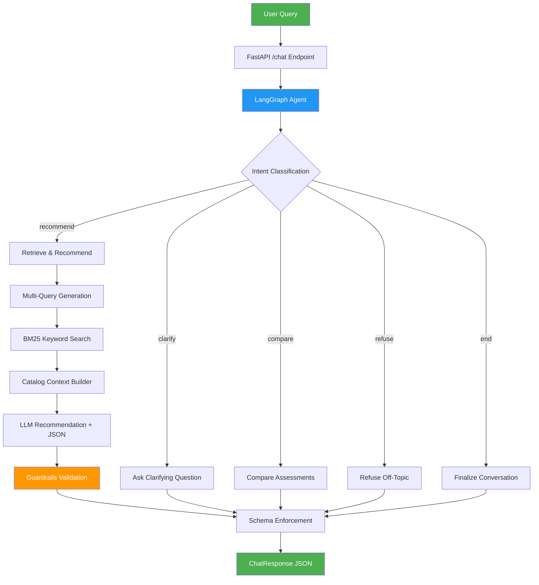
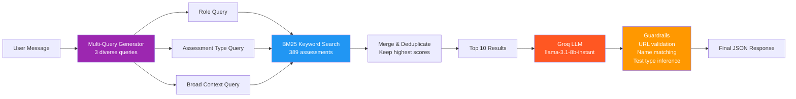
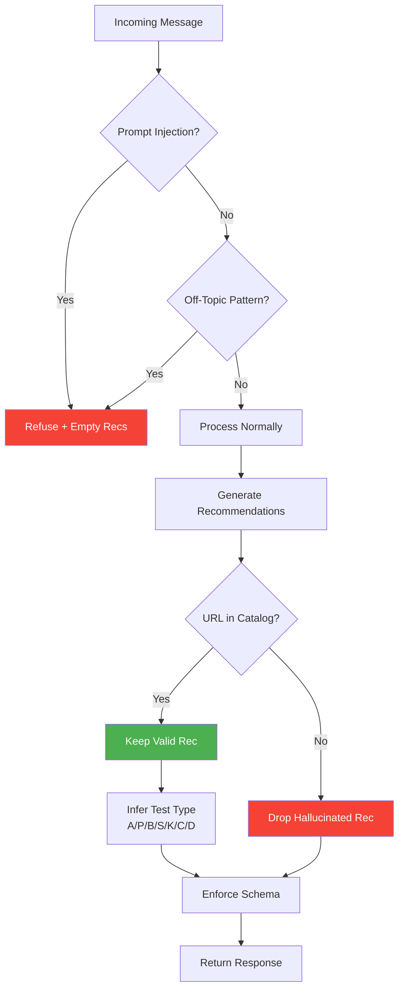

# SHL Assessment Recommender API

A conversational AI-powered API that helps hiring managers find the right SHL assessments through multi-turn dialogue.

## Live Demo

- **API URL:** `https://shl-recommender-1zv8.onrender.com`
- **Health Check:** [/health](https://shl-recommender-1zv8.onrender.com/health)
- **Swagger Docs:** [/docs](https://shl-recommender-1zv8.onrender.com/docs)

## Architecture



## System Design

### Hybrid Retrieval Pipeline



### Safety & Guardrails Flow



## API Endpoints

| Method | Endpoint | Description |
|--------|----------|-------------|
| `GET` | `/health` | Health check → `{"status": "ok"}` |
| `POST` | `/chat` | Conversational recommendation (main endpoint) |
| `POST` | `/recommend` | One-shot JD → recommendations |
| `GET` | `/catalog` | Full SHL catalog as JSON |
| `GET` | `/catalog/search?q=` | Keyword search over catalog |
| `GET` | `/docs` | Swagger UI |

## Chat Request/Response Schema

**Request:**
```json
{
  "messages": [
    {"role": "user", "content": "I need assessments for hiring Java developers"}
  ]
}
```

**Response:**
```json
{
  "reply": "Here are recommended SHL assessments...",
  "recommendations": [
    {
      "name": "Smart Interview Live Coding",
      "url": "https://www.shl.com/products/product-catalog/view/smart-interview-live-coding/",
      "test_type": "S"
    }
  ],
  "end_of_conversation": false
}
```

## Tech Stack

| Component | Technology |
|-----------|-----------|
| **API Framework** | FastAPI |
| **Agent Framework** | LangGraph (StateGraph) |
| **LLM** | Groq - llama-3.1-8b-instant |
| **Retrieval** | BM25 (rank-bm25) |
| **Catalog** | 389 SHL assessments (catalog.json) |
| **Deployment** | Render (Free Tier) |

## Key Features

- **Multi-turn Conversation:** Supports clarification, recommendation, comparison, and refinement
- **Multi-Query Search:** Generates 3 diverse queries per request for maximum recall
- **Guardrails:** Prompt injection detection, off-topic refusal, URL validation against catalog
- **Test Type Inference:** Automatically classifies assessments as A (Ability), P (Personality), B (SJT), S (Simulation), K (Knowledge), C (Competency)
- **Rate Limit Handling:** Automatic retry with exponential backoff for Groq API limits
- **Schema Enforcement:** Every response guaranteed to have `reply`, `recommendations[]`, `end_of_conversation`

## Project Structure

```
shl-recommender/
├── main.py           # FastAPI app, endpoints, lifespan
├── agent.py          # LangGraph agent (classify, recommend, compare, refuse)
├── retriever.py      # BM25 search engine
├── guardrails.py     # URL validation, test type inference, injection detection
├── schemas.py        # Pydantic request/response models
├── prompts.py        # All LLM prompts centralized
├── catalog.json      # 389 SHL assessments (source of truth)
├── scraper.py        # SHL catalog scraper
├── requirements.txt  # Python dependencies
└── render.yaml       # Render deployment config
```

## Local Setup

```bash
# Clone
git clone https://github.com/Yashraj0906/shl_recommender.git
cd shl_recommender

# Virtual environment
python -m venv venv
venv\Scripts\activate  # Windows

# Install dependencies
pip install -r requirements.txt

# Set environment variables
echo GROQ_API_KEY=your_key_here > .env

# Run
python main.py
# API available at http://localhost:10000
```

## Approach

### 1. Data Collection
Scraped 389 individual test solutions from the SHL Product Catalog using BeautifulSoup, extracting names, URLs, descriptions, job levels, and duration.

### 2. Retrieval
BM25 keyword matching over rich text representations (name + description + job levels + test type labels). Multi-query strategy generates 3 diverse queries to maximize recall.

### 3. Agent Design
LangGraph StateGraph with 5 action nodes: classify_intent → clarify / recommend / compare / refuse / finalize. Stateless design — full conversation history sent on every request.

### 4. Safety
Three-layer defense: (1) Regex-based prompt injection detection, (2) Programmatic off-topic pattern matching, (3) Post-generation URL/name validation against catalog.

### 5. Deployment
Render free tier with BM25-only retrieval (~50MB RAM). CPU-only, no PyTorch/FAISS needed.
